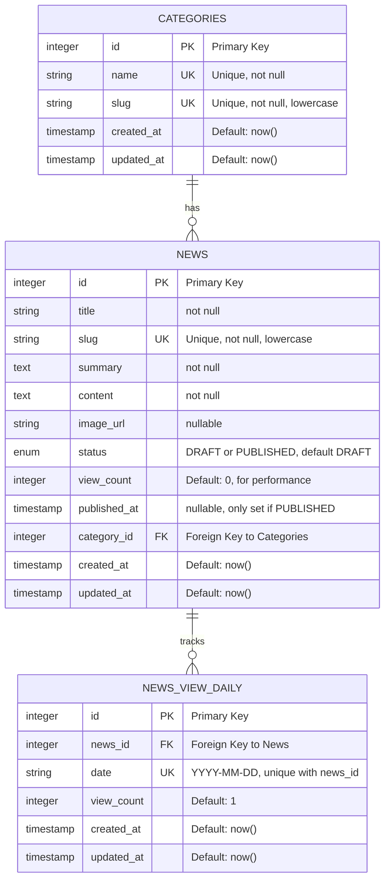

# Entity Relationship Diagram (ERD)

## Database Schema



## Table Definitions

### categories

Stores news categories/topics.

| Column | Type | Constraints | Notes |
|--------|------|-------------|-------|
| id | SERIAL PRIMARY KEY | auto-increment | |
| name | VARCHAR(255) | UNIQUE, NOT NULL | e.g., "Technology" |
| slug | VARCHAR(255) | UNIQUE, NOT NULL | e.g., "technology", lowercase for URLs |
| created_at | TIMESTAMP | DEFAULT NOW() | |
| updated_at | TIMESTAMP | DEFAULT NOW() | |

**Indexes:**
- Primary key on `id`
- Unique constraint on `slug`

### news

Stores news articles with draft/publish workflow.

| Column | Type | Constraints | Notes |
|--------|------|-------------|-------|
| id | SERIAL PRIMARY KEY | auto-increment | |
| title | VARCHAR(500) | NOT NULL | Article headline |
| slug | VARCHAR(500) | UNIQUE, NOT NULL | URL-friendly identifier |
| summary | TEXT | NOT NULL | Short excerpt for listings |
| content | TEXT | NOT NULL | Full article body |
| image_url | VARCHAR(500) | nullable | Featured image URL |
| status | ENUM('DRAFT', 'PUBLISHED') | DEFAULT 'DRAFT' | Publication state |
| view_count | INTEGER | DEFAULT 0 | Cached for performance |
| published_at | TIMESTAMP | nullable | Only set when status='PUBLISHED' |
| category_id | INTEGER | FOREIGN KEY, NOT NULL | References categories.id |
| created_at | TIMESTAMP | DEFAULT NOW() | |
| updated_at | TIMESTAMP | DEFAULT NOW() | |

**Indexes:**
- Primary key on `id`
- Unique constraint on `slug`
- Foreign key on `category_id` (with CASCADE DELETE)
- Index on `status` (for filtering PUBLISHED articles)
- Index on `published_at` (for sorting by publication date)

### news_view_daily

Tracks daily view counts per article for analytics.

| Column | Type | Constraints | Notes |
|--------|------|-------------|-------|
| id | SERIAL PRIMARY KEY | auto-increment | |
| news_id | INTEGER | FOREIGN KEY, NOT NULL | References news.id |
| date | DATE | UNIQUE with news_id | ISO format (YYYY-MM-DD) |
| view_count | INTEGER | DEFAULT 1 | Incremented each view on that date |
| created_at | TIMESTAMP | DEFAULT NOW() | |
| updated_at | TIMESTAMP | DEFAULT NOW() | |

**Indexes:**
- Primary key on `id`
- Composite unique constraint on `(news_id, date)`
- Foreign key on `news_id` (with CASCADE DELETE)

## Relationships

1. **Categories → News (1:Many)**
   - One category has many news articles
   - Delete cascade: removing a category removes its news

2. **News → NewsViewDaily (1:Many)**
   - One news article has many daily view records
   - Delete cascade: removing a news article removes its view history

## View Performance

- `view_count` in NEWS table is denormalized for fast "most viewed" queries
- `news_view_daily` provides granular daily analytics
- Both are synchronized when articles are accessed

## Migration Strategy

Migrations are generated by Drizzle Kit and stored in `drizzle/` directory:

- PostgreSQL migrations: `*.pgsql.sql`
- SQLite migrations: `*.sqlite.sql`

Run migrations with:
```bash
pnpm db:migrate
```

## Future Enhancements

1. **Users Table** - Support multiple admin users
   - Add user roles (editor, admin, viewer)
   - Track article authors

2. **Comments Table** - Enable reader discussions
   - Associate comments with news articles
   - Support moderation flags

3. **Tags Table** - Cross-category organization
   - Many-to-many relationship with news
   - Filter by multiple tags

4. **Audit Log Table** - Track all changes
   - Record who edited what and when
   - Support for compliance/GDPR

5. **Analytics Table** - Advanced statistics
   - Track referral sources
   - Device/browser breakdown
   - Geographic data
